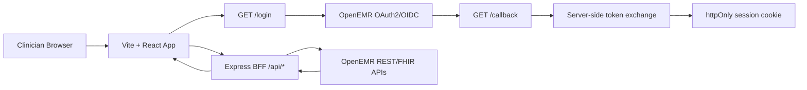

# Product Requirements Document: OpenEMR Patient Dashboard Modernization

## 1. Executive Summary

**Problem Statement**

OpenEMR's existing patient dashboard is a PHP-rendered, server-side experience. Clinics depend on OpenEMR today, so the goal is not to redesign clinical workflows; the goal is to reimplement the existing patient dashboard presentation layer in a modern frontend framework while continuing to consume OpenEMR's existing REST and FHIR APIs.

**Proposed Solution**

Build a Vite + React + TypeScript patient dashboard backed by a small Express BFF that handles OAuth2/OpenID Connect token exchange, keeps secrets server-side, and proxies OpenEMR FHIR resources to the browser through authenticated same-origin API routes. The dashboard must preserve the expected OpenEMR patient-dashboard information architecture: a persistent patient identity header, required clinical cards, and one additional API-backed clinical section.

**Success Criteria**

- A user can authenticate via OpenEMR OAuth2/OpenID Connect and land in the React application without exposing OAuth client secrets to the browser.
- The dashboard renders a selected patient's persistent header with name, date of birth, sex, MRN, and active status from live FHIR `Patient` data.
- The dashboard renders live FHIR-backed cards for Allergies, Problem List, Medications, Prescriptions, and Care Team.
- The dashboard renders Encounter History as the additional live API-backed section.
- `PATIENT_DASHBOARD_MIGRATION.md` exists at the repo root and clearly defends the framework choice, benefits of leaving PHP-rendered presentation, and tradeoffs introduced by the new architecture.
- `bun run build`, `bun run lint`, and relevant route/API tests pass before final delivery.

**Current Completion Snapshot**

- [x] Challenge brief reviewed from `docs/AgentForge—Clinical-Co-Pilot-W2—Surprise-Challenge_Modernize-the-Patient-Dashboard.txt`.
- [x] Challenge brief confirmed against `docs/AgentForge—Clinical-Co-Pilot-W2—Surprise-Challenge_Modernize-the-Patient-Dashboard.pdf`.
- [x] Repo uses Vite + React + TypeScript under `src/`.
- [x] Repo uses Bun for package scripts and dependency workflow.
- [x] Express BFF exists under `server/`.
- [x] OAuth authorization redirect route exists at `GET /login`.
- [x] OAuth callback route exists at `GET /callback`.
- [x] OAuth token exchange is server-side in `server/services/oauth-service.ts`.
- [x] Access token is stored in an httpOnly cookie.
- [x] Logout route exists at `POST /api/logout`.
- [x] Basic FHIR `Patient` proxy exists at `GET /api/patients`.
- [x] Basic patient list route exists at `/patients`.
- [x] Product direction confirmed: keep a patient list and add patient search rather than automatically opening the first patient.
- [x] Product direction confirmed: additional section is Encounter History.
- [x] Product direction confirmed: OAuth `state` hardening is security polish after dashboard feature parity.
- [x] OpenEMR sibling repo identified as a source reference at `/Users/michaelhabermas/repos/GAI/openemr`.
- [x] Demo seed fixture identified at `/Users/michaelhabermas/repos/GAI/openemr/agent-forge/fixtures/demo-patient-ground-truth.json`.
- [ ] Patient dashboard route provides feature parity with the OpenEMR patient dashboard.
- [ ] Persistent patient identity header is implemented.
- [ ] Allergies card is implemented from live FHIR data.
- [ ] Problem List card is implemented from live FHIR data.
- [ ] Medications card is implemented from live FHIR data.
- [ ] Prescriptions card is implemented from live FHIR data.
- [ ] Care Team card is implemented from live FHIR data.
- [ ] Additional clinical section is implemented from live API data.
- [ ] `PATIENT_DASHBOARD_MIGRATION.md` is written.

## 2. User Experience & Functionality

### User Personas

**Clinician**

A clinician needs to review a patient's core clinical context quickly before or during care. The dashboard must surface identity, active status, allergies, problems, medications, prescriptions, care team, and recent clinical context without forcing the clinician through multiple OpenEMR pages.

**Clinical support staff**

Clinical support staff need a reliable patient overview for intake, follow-up, and administrative coordination. They require clear patient identification, active/inactive status, care team visibility, and enough clinical context to route work safely.

**Technical evaluator**

The AgentForge evaluator needs to verify that the project is a faithful modernization of the OpenEMR patient dashboard, not a speculative redesign. They need to see live API usage, a defensible framework choice, and clear implementation tradeoffs.

### Primary User Flow

1. The user opens the React app.
2. The user clicks "Login with OpenEMR."
3. The BFF redirects the user to OpenEMR's OAuth2 authorization endpoint.
4. The user completes OpenEMR login and consent.
5. OpenEMR redirects to the BFF callback with an authorization code.
6. The BFF exchanges the code for an access token and stores it in an httpOnly cookie.
7. The app routes the user to the patient experience.
8. The user searches or scans the patient list.
9. The user selects a patient from the list.
10. The dashboard fetches patient identity and clinical resources through same-origin BFF endpoints.
11. The user reviews the patient header, required clinical cards, and Encounter History.
12. The user can log out, clearing the session cookie.

### User Stories and Acceptance Criteria

**Story 1: Authenticate with OpenEMR**

As a clinician, I want to log in through OpenEMR OAuth2/OpenID Connect so that dashboard access is tied to the existing OpenEMR identity and permission model.

Acceptance criteria:

- [x] Login is initiated through a BFF route instead of a browser-side token exchange.
- [x] The BFF exchanges authorization codes server-side.
- [x] Client secret remains server-only and is not shipped in frontend assets.
- [x] The browser receives an httpOnly cookie rather than a raw access token.
- [x] Logging out clears the access-token cookie.
- [ ] Authentication failures display a user-facing error state with enough context to retry or check configuration.
- [ ] The OAuth `state` parameter is generated, stored, and verified rather than hard-coded. This is security polish after dashboard feature parity.
- [ ] Required OAuth scopes include every FHIR resource needed by the final dashboard.

**Story 1A: Search and select a patient**

As a clinician, I want to search and select from a patient list so that I can open the correct patient dashboard deliberately.

Acceptance criteria:

- [x] A basic patient list route exists at `/patients`.
- [ ] The patient list includes a search input for filtering by patient name and available identifiers.
- [ ] Patient rows display enough identity information to distinguish similar names, including name, DOB when available, sex when available, MRN/identifier when available, and active status when available.
- [ ] Selecting a patient opens a stable patient dashboard route such as `/patients/:patientId`.
- [ ] Search/filtering handles empty results without clearing the authenticated session.
- [ ] The patient list remains a distinct entry point rather than automatically opening the first returned patient.

**Story 2: Identify the patient safely**

As a clinician, I want a persistent patient header so that I can confirm I am viewing the correct patient while reviewing clinical cards.

Acceptance criteria:

- [ ] The header remains visible above the clinical-card content on the dashboard.
- [ ] The header displays patient name from FHIR `Patient.name`.
- [ ] The header displays date of birth from FHIR `Patient.birthDate`.
- [ ] The header displays sex from FHIR `Patient.gender`.
- [ ] The header displays MRN from the appropriate FHIR `Patient.identifier` value.
- [ ] The header displays active status from FHIR `Patient.active`.
- [ ] Missing fields render explicit empty states such as "Unknown" or "Not recorded" rather than blank UI.
- [ ] Header content is accessible to screen readers and does not rely on color alone for active/inactive status.

**Story 3: Review allergies**

As a clinician, I want to see allergy and intolerance information so that I can avoid unsafe medication or care decisions.

Acceptance criteria:

- [ ] The dashboard fetches allergies from live FHIR data, preferably `AllergyIntolerance?patient={id}`.
- [ ] Each allergy row displays allergen/substance, clinical status, verification status when available, reaction when available, and severity when available.
- [ ] The card handles no-known-allergy or no-data responses distinctly from fetch errors when the API provides enough signal.
- [ ] Errors in this card do not blank the entire dashboard.

**Story 4: Review active and historical problems**

As a clinician, I want to see the patient's problem list so that I can understand current and historical diagnoses.

Acceptance criteria:

- [ ] The dashboard fetches problems from live FHIR data, preferably `Condition?patient={id}`.
- [ ] Each problem displays condition name/code text, clinical status, onset or recorded date when available, and category when available.
- [ ] Active problems are visually distinguishable from inactive/resolved problems without relying on color alone.
- [ ] Empty, loading, and error states are handled at the card level.

**Story 5: Review medications**

As a clinician, I want to see current medication information so that I can understand the patient's medication context.

Acceptance criteria:

- [ ] The dashboard fetches medication-related data from live FHIR resources, such as `MedicationRequest`, `MedicationStatement`, or OpenEMR-supported medication endpoints.
- [ ] Each medication displays name, status, dosage instructions when available, authored/effective date when available, and prescriber when available.
- [ ] The implementation documents any OpenEMR-specific distinction between Medications and Prescriptions.
- [ ] Empty, loading, and error states are handled at the card level.

**Story 6: Review prescriptions**

As a clinician, I want to see prescriptions separately from general medication context so that orders and medication history are not conflated.

Acceptance criteria:

- [ ] The dashboard fetches prescription/order data from live FHIR data or OpenEMR REST API data.
- [ ] Each prescription displays medication name, status, intent when available, authored date when available, dosage when available, and requester/prescriber when available.
- [ ] The card clearly communicates when a prescription is active, stopped, completed, or unknown.
- [ ] If OpenEMR exposes medications and prescriptions through overlapping resources, the mapping is documented in implementation notes and `PATIENT_DASHBOARD_MIGRATION.md`.

**Story 7: Review care team**

As a clinician or support staff member, I want to see the patient's care team so that I can identify responsible providers and care relationships.

Acceptance criteria:

- [ ] The dashboard fetches care team data from live FHIR data, preferably `CareTeam?patient={id}`.
- [ ] Each care team participant displays name, role, status, and contact/reference information when available.
- [ ] Practitioner or organization references are resolved or displayed clearly enough to be clinically useful.
- [ ] Empty, loading, and error states are handled at the card level.

**Story 8: Review encounter history**

As a clinician, I want to see recent encounters so that I can understand the patient's recent care timeline.

Acceptance criteria:

- [x] Encounter History is the selected additional section.
- [ ] The dashboard fetches encounters from live FHIR data, preferably `Encounter?patient={id}`.
- [ ] Each encounter displays type/class, status, start date/time, end date/time when available, location when available, and provider/participant when available.
- [ ] Encounters are sorted reverse chronologically when dates are available.
- [ ] The section has loading, empty, partial-data, and error states.

**Story 9: Defend the modernization**

As a technical evaluator, I want a written migration defense so that I can judge whether the framework choice was intentional and whether tradeoffs were understood.

Acceptance criteria:

- [ ] `PATIENT_DASHBOARD_MIGRATION.md` exists in the repository root.
- [ ] The document explains why Vite + React + TypeScript was chosen.
- [ ] The document explains what was gained by moving presentation from PHP-rendered server pages to a typed client app.
- [ ] The document explains tradeoffs, including BFF complexity, client-side state/error handling, build tooling, and OAuth/session concerns.
- [ ] The document explains how OpenEMR remains the system of record and why backend changes were intentionally avoided.

### Non-Goals

- Creating an exact pixel-for-pixel clone of the PHP dashboard. The target is a clean, familiar, good-faith modernization that preserves clinical information hierarchy and workflow expectations.
- Redesigning the OpenEMR patient dashboard UX beyond what is necessary to implement the existing dashboard in the modern stack.
- Replacing OpenEMR as the clinical system of record.
- Modifying OpenEMR backend behavior, database schema, or core PHP application code.
- Storing OAuth client secrets or access tokens in browser-accessible storage.
- Building write workflows for clinical resources unless needed for authentication or dashboard display.
- Building a full patient search replacement beyond what is needed to select or demonstrate a dashboard patient.
- Adding dotenv or alternative environment-loading behavior for the BFF; Bun already loads `.env` locally.

## 3. AI System Requirements

This project is not an AI inference feature. No model-generated clinical summaries, diagnosis suggestions, treatment recommendations, or autonomous clinical actions are in scope for the dashboard modernization PRD.

If AI-assisted development tools are used during implementation, they must be limited to engineering assistance. The final application must display source-of-record OpenEMR API data and must not transform clinical meaning through unchecked generative summarization.

## 4. Technical Specifications

### Architecture Overview

The target architecture is a React single-page application served by Vite in development and backed by an Express BFF. OpenEMR remains the source of authentication and clinical data.

Current implementation state:

- [x] React router is configured in `src/App.tsx`.
- [x] Shared app layout exists in `src/components/AppLayout.tsx`.
- [x] Basic UI card/button primitives exist in `src/components/ui/`.
- [x] API fetch helper sends same-origin requests with credentials in `src/lib/api/http.ts`.
- [x] OAuth service exists in `server/services/oauth-service.ts`.
- [x] FHIR service exists in `server/services/fhir-service.ts`.
- [x] BFF routes exist in `server/index.ts`.

Target implementation additions:

- [ ] Add dashboard-specific API client methods under `src/lib/api/`.
- [ ] Expand FHIR type coverage in `src/types/fhir.ts`.
- [ ] Add patient dashboard helpers for display name, MRN selection, status formatting, dates, coding text, and reference display.
- [ ] Add BFF routes for patient detail and required clinical resources.
- [ ] Keep `/patients` as patient list/search and add patient dashboard navigation.
- [ ] Add component-level loading, empty, and error states for each clinical section.

### Data Requirements

**Patient header**

FHIR resource:

- `Patient`

Required fields:

- `Patient.name`
- `Patient.birthDate`
- `Patient.gender`
- `Patient.identifier`
- `Patient.active`

**Allergies**

Preferred FHIR resource:

- `AllergyIntolerance`

Recommended fields:

- `code`
- `clinicalStatus`
- `verificationStatus`
- `reaction`
- `criticality`
- `recordedDate`

**Problem List**

Preferred FHIR resource:

- `Condition`

Recommended fields:

- `code`
- `clinicalStatus`
- `verificationStatus`
- `category`
- `onsetDateTime`
- `recordedDate`

**Medications**

Potential FHIR resources:

- `MedicationStatement`
- `MedicationRequest`

Recommended fields:

- medication display text from `medicationCodeableConcept` or `medicationReference`
- `status`
- `dosage`
- `effectiveDateTime` or `authoredOn`

**Prescriptions**

Potential FHIR resources:

- `MedicationRequest`
- OpenEMR REST prescription endpoint if FHIR separation is insufficient

Recommended fields:

- medication display text
- `status`
- `intent`
- `authoredOn`
- `dosageInstruction`
- `requester`

**Care Team**

Preferred FHIR resource:

- `CareTeam`

Recommended fields:

- `status`
- `participant.role`
- `participant.member`
- `period`

**Additional section: Encounter History**

Preferred FHIR resource:

- `Encounter`

Recommended fields:

- `status`
- `class`
- `type`
- `period`
- `location`
- `participant`

### Source Reference and Demo Data

The sibling OpenEMR repository at `/Users/michaelhabermas/repos/GAI/openemr` is an implementation reference for familiarity, terminology, and seeded clinical data. It should inform the modernization, but the React dashboard should not copy PHP templates verbatim or depend on OpenEMR internals at runtime.

Useful reference locations identified so far:

- `/Users/michaelhabermas/repos/GAI/openemr/interface/patient_file/summary/stats.php`
- `/Users/michaelhabermas/repos/GAI/openemr/interface/patient_file/summary/stats_full.php`
- `/Users/michaelhabermas/repos/GAI/openemr/interface/patient_file/summary/dashboard_header.php`
- `/Users/michaelhabermas/repos/GAI/openemr/templates/patient/dashboard_header.html.twig`
- `/Users/michaelhabermas/repos/GAI/openemr/templates/patient/demographics/`
- `/Users/michaelhabermas/repos/GAI/openemr/agent-forge/fixtures/demo-patient-ground-truth.json`

Seed-data expectations from the fixture:

- Demo patient `900001`, public ID `AF-DEMO-900001`, Alex Testpatient, has demographics, recent encounter, active problems, active medications, active allergies, recent labs, recent vitals, and a recent note.
- Demo patient `900002`, public ID `AF-DEMO-900002`, Riley Medmix, has demographics, recent encounter, active problems, and active medications.
- The fixture should be used as a guide to identify useful demo patients in the deployed OpenEMR instance; live dashboard data must still come from OpenEMR API responses.

### API and Integration Points

Existing BFF endpoints:

- [x] `GET /login`: redirects to OpenEMR authorization endpoint.
- [x] `GET /callback`: exchanges OAuth code and sets httpOnly cookie.
- [x] `POST /api/logout`: clears cookie.
- [x] `GET /api/patients`: proxies FHIR `Patient` search.

Target BFF endpoints:

- [ ] `GET /api/patients`: keep existing patient search for patient selection.
- [ ] `GET /api/patients/:patientId`: fetch one patient by ID.
- [ ] `GET /api/patients/:patientId/allergies`: proxy allergy data.
- [ ] `GET /api/patients/:patientId/problems`: proxy condition/problem data.
- [ ] `GET /api/patients/:patientId/medications`: proxy medication data.
- [ ] `GET /api/patients/:patientId/prescriptions`: proxy prescription/order data.
- [ ] `GET /api/patients/:patientId/care-team`: proxy care team data.
- [ ] `GET /api/patients/:patientId/encounters`: proxy encounter history.

Implementation requirements:

- All BFF clinical endpoints must require a valid access-token cookie.
- BFF endpoints should return upstream FHIR JSON without mutating clinical meaning.
- BFF endpoints may normalize transport errors into consistent HTTP error responses.
- Frontend code should treat each clinical card as independently loadable so one upstream resource failure does not hide all other patient data.

### Frontend Requirements

The frontend must feel like a clinical operations surface rather than a marketing page. It should prioritize scannability, density, stable layout, accessibility, and predictable navigation.

Required views:

- [x] Login/connect screen exists.
- [x] Basic patient list exists.
- [ ] Patient dashboard view exists.
- [ ] Patient search exists.
- [ ] Patient selector or route strategy supports opening a specific patient dashboard.

Dashboard layout requirements:

- [ ] Persistent patient header appears before clinical sections.
- [ ] Required clinical cards are visible in a responsive grid or organized sections.
- [ ] Each card has a consistent title, data rows, empty state, loading state, and error state.
- [ ] Clinical content uses readable timestamps and labels.
- [ ] Long clinical names or instructions wrap without breaking layout.
- [ ] The layout works at mobile, tablet, and desktop widths.
- [ ] Interactive controls use accessible button/link semantics.

### Security and Privacy

Security requirements:

- [x] OAuth client secret is used only in the server process.
- [x] Access token is stored in an httpOnly cookie.
- [x] API calls from the browser use same-origin credentials.
- [x] `.env` must not be read or committed by agents; `.env.example` is the source for documented configuration.
- [ ] OAuth state must be generated and validated to reduce CSRF risk.
- [ ] Cookies should use `secure: true` in production.
- [ ] BFF logs must avoid printing access tokens, client secrets, or full patient payloads.
- [ ] Error messages shown to the browser must not expose secrets.
- [ ] Final documentation must explain that OpenEMR remains the system of record.

Privacy requirements:

- The frontend must not persist patient data to localStorage, sessionStorage, IndexedDB, or analytics tools.
- The dashboard must not send patient data to third-party services.
- Any development screenshots or demo artifacts must avoid real patient data unless the user explicitly supplies a permitted test dataset.

### Performance Requirements

- Initial authenticated dashboard data should begin rendering within 2 seconds on a local development connection to OpenEMR when the upstream API is responsive.
- Clinical sections should load independently where practical, allowing patient identity to render even if one clinical endpoint is slow.
- The frontend bundle should remain compatible with Vite production build defaults and should not introduce large data or charting dependencies unless required by the selected additional section.
- Repeated display helpers should be deterministic and memoizable without hidden network calls.

### Accessibility Requirements

- All dashboard content must be reachable by keyboard.
- Clinical cards must use semantic headings and lists/tables where appropriate.
- Active/inactive and error states must not rely on color alone.
- Loading states must be perceivable without layout jumps that obscure surrounding clinical data.
- Text contrast must meet WCAG AA for normal text.

### Testing Requirements

Build and static verification:

- [ ] `bun run typecheck` passes.
- [ ] `bun run lint` passes.
- [ ] `bun run build` passes.

Suggested automated tests:

- [ ] FHIR display helpers handle missing fields, coding arrays, references, and dates.
- [ ] Patient extraction handles non-Bundle, empty Bundle, and Bundle entries without resources.
- [ ] API client functions surface 401 responses and non-JSON error bodies safely.
- [ ] Dashboard cards render loading, empty, error, and populated states.

Manual QA:

- [ ] Login flow reaches OpenEMR and returns to the app.
- [ ] Logout clears session and prevents protected API access.
- [ ] Patient dashboard renders live data for at least one test patient.
- [ ] Refreshing the dashboard page preserves authenticated access via httpOnly cookie.
- [ ] Missing resource permissions produce clear card-level errors.
- [ ] Mobile-width layout remains readable and does not overlap content.

## 5. Risks & Roadmap

### Technical Risks

**FHIR endpoint availability**

OpenEMR installations may expose slightly different FHIR resource coverage, scopes, or search behavior. Mitigation: implement endpoint-specific errors, document tested resources, and keep mappings isolated in BFF/FHIR service functions.

**Medication versus prescription semantics**

FHIR resources can represent medication statements, medication requests, and prescriptions with overlapping fields. Mitigation: choose explicit mappings during implementation and document them in `PATIENT_DASHBOARD_MIGRATION.md`.

**OAuth state and session hardening**

The current implementation uses a hard-coded OAuth state value. Mitigation: generate per-login state, store it server-side or in a secure httpOnly transient cookie, and validate it on callback.

**Clinical data display safety**

Missing FHIR fields can cause blank or misleading UI if not handled deliberately. Mitigation: centralize display helpers and use explicit unknown/not-recorded states.

**Scope creep into redesign**

The prompt says the UX has already been addressed and the task is reimplementation. Mitigation: keep UI changes focused on faithfully rendering required dashboard data in the chosen stack.

### Phased Rollout

**Phase 0: Baseline and requirements**

- [x] Confirm challenge scope from text and PDF.
- [x] Identify current repo stack and existing implementation.
- [x] Create this PRD.

**Phase 1: Authentication and FHIR foundation**

- [x] Establish Vite + React frontend.
- [x] Establish Express BFF.
- [x] Implement OAuth authorization and token exchange.
- [x] Implement basic patient search proxy.
- [ ] Expand OAuth scopes for selected dashboard resources.
- [ ] Add typed BFF service methods for dashboard FHIR resources.

**Phase 2: Dashboard MVP**

- [ ] Implement patient search.
- [ ] Implement patient selection and patient dashboard routing.
- [ ] Implement persistent patient header.
- [ ] Implement Allergies card.
- [ ] Implement Problem List card.
- [ ] Implement Medications card.
- [ ] Implement Prescriptions card.
- [ ] Implement Care Team card.
- [ ] Implement Encounter History as the additional section.

**Phase 3: Quality and defense**

- [ ] Add helper and rendering tests where risk is highest.
- [ ] Run typecheck, lint, and production build.
- [ ] Write `PATIENT_DASHBOARD_MIGRATION.md`.
- [ ] Perform manual QA against a configured OpenEMR instance.
- [ ] Capture any known API or fixture limitations in documentation.
- [ ] Harden OAuth state handling after dashboard feature parity.

**Phase 4: Polish if time permits**

- [ ] Improve patient search filtering if multiple patients are available.
- [ ] Add skeleton loaders for card-level loading states.
- [ ] Add route-level error boundaries.
- [ ] Add lightweight request cancellation for patient switching.
- [ ] Add additional section switcher if more than one optional resource is implemented.

## Source Materials

- `docs/AgentForge—Clinical-Co-Pilot-W2—Surprise-Challenge_Modernize-the-Patient-Dashboard.txt`
- `docs/AgentForge—Clinical-Co-Pilot-W2—Surprise-Challenge_Modernize-the-Patient-Dashboard.pdf`
- Current repository implementation under `src/`, `server/`, `README.md`, and `package.json`
