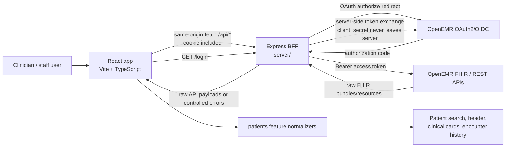
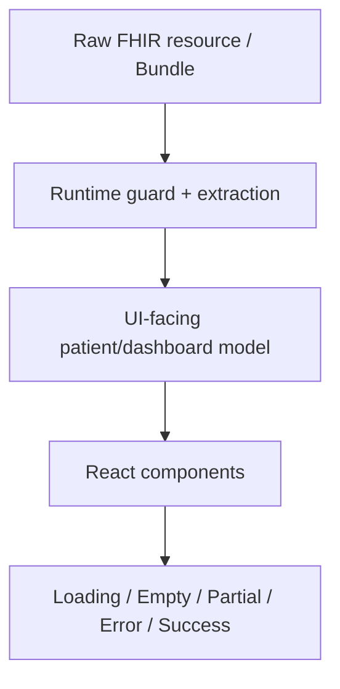
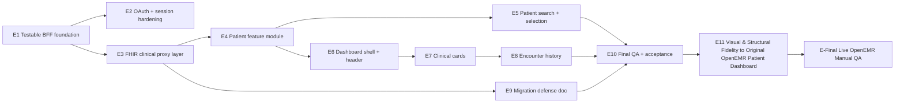

# OpenEMR Patient Dashboard Modernization Execution Plan

## How To Use This Plan

This is the working execution tracker for modernizing the OpenEMR patient dashboard in this repo. It is meant for AI coding agents and humans to use directly while building, not just as an architecture note.

Update this file as implementation progresses.

Status markers:

- `[ ]` Not started
- `[~]` In progress
- `[x]` Complete and verified
- `[!]` Blocked; add a blocker note before moving on
- `[?]` Needs product or technical decision

Rules for agents:

- Mark a task `[~]` before starting it.
- Mark a task `[x]` only after its Definition of Done and verification steps pass.
- Add a short completion note when finishing an epic or task.
- Do not silently expand scope. Add new tasks under the relevant epic.
- Do not edit `/Users/michaelhabermas/repos/GAI/openemr`; use it as reference only.
- Do not read `.env` or other live env files. Use `.env.example` and ask a human to verify local values.
- Use Bun for all scripts and package workflows.
- Keep OpenEMR as the system of record.
- Keep OAuth client secrets and token exchange server-only.

## Mission

Port the OpenEMR patient dashboard presentation layer to the existing Vite + React + TypeScript app, backed by the existing Express BFF. The goal is feature parity with the challenge brief in `docs/AgentForge—Clinical-Co-Pilot-W2—Surprise-Challenge_Modernize-the-Patient-Dashboard.txt` and the requirements in `docs/PRD.md`.

This is not a broad clinical workflow redesign. This is a modern presentation-layer reimplementation that consumes OpenEMR OAuth, REST, and FHIR APIs.

## System Diagram



## FHIR Normalization Pipeline



## Epic Dependency Map



## Epic Tracker

| Epic | Status | Purpose |
| --- | --- | --- |
| E1: Testable BFF Foundation | `[x]` | Split server wiring from listener startup and establish test seams. |
| E2: OAuth And Session Hardening | `[x]` | Replace static OAuth state and tighten auth/session behavior. |
| E3: FHIR Clinical Proxy Layer | `[x]` | Add patient-scoped proxy endpoints for required dashboard resources. |
| E4: Patient Feature Module | `[x]` | Deepen `src/features/patients` with API, types, normalizers, hooks, and components. |
| E5: Patient Search And Selection | `[x]` | Upgrade `/patients` into the deliberate patient picker. |
| E6: Dashboard Shell And Patient Header | `[x]` | Add `/patients/:patientId` and persistent patient identity header. |
| E7: Required Clinical Cards | `[x]` | Render Allergies, Problem List, Medications, Prescriptions, and Care Team. |
| E8: Encounter History | `[x]` | Render additional API-backed Encounter History section. |
| E9: Migration Defense Documentation | `[x]` | Add `PATIENT_DASHBOARD_MIGRATION.md`. |
| E10: Final QA And Acceptance | `[x]` | Verify full challenge/PRD completion. |
| E11: Live OpenEMR Manual QA | `[!]` | Verify the completed app against a configured OpenEMR instance and browser viewports. |
| E12: Live FHIR Mapping Reconciliation | `[!]` | Resolve live data mapping questions for prescriptions, MRN, and patient search. |
| E13: Post-MVP UX Resilience Polish | `[ ]` | Add resilience and UX polish after live QA clarifies the highest-value gaps. |

## E1: Testable BFF Foundation

Status: `[x]`

Completion note, 2026-05-06: Added `server/app.ts` as a pure Express app factory with injected OAuth/FHIR services, kept `server/index.ts` as runtime bootstrap and static `dist` serving only, and added Bun route/config tests. Verified with `bun run typecheck` and `bun test`.

### Goal

Make the Express BFF testable and easier to extend before adding OAuth hardening and many FHIR endpoints. The current `server/index.ts` starts the listener at import time, which makes route tests awkward and encourages endpoint logic to accrete in one file.

### Likely Files

- `server/index.ts`
- `server/app.ts` or equivalent new app-factory file
- `server/services/oauth-service.ts`
- `server/services/fhir-service.ts`
- `server/config.ts`
- `server/**/*.test.ts`

### Tasks

#### E1.T1: Split Express app creation from listener startup

Status: `[x]`

Completion note, 2026-05-06: `createApp({ config, services })` can be imported and tested without starting a listener. `server/index.ts` still loads config, creates real services, attaches `dist` serving when present, and calls `listen`.

Work:

- Extract app creation into a pure factory, for example `createApp({ config, oauth, fhir })`.
- Keep `server/index.ts` responsible for loading config, creating services, creating the app, serving `dist`, and calling `listen`.
- Preserve current runtime behavior for `bun run dev:server` and production serving.

Definition of Done:

- Importing the app factory does not start a network listener.
- Existing routes still behave the same at runtime.
- Static `dist` serving behavior is preserved.
- The app factory can accept fake OAuth/FHIR services in tests.

Verify:

```bash
bun run typecheck
bun test
```

#### E1.T2: Define server service interfaces for dependency injection

Status: `[x]`

Completion note, 2026-05-06: Route code now depends on injected `OAuthService` and `FhirService` interfaces. Runtime wiring still uses `createOAuthService(config)` and `createFhirService(config)`.

Work:

- Keep or formalize `OAuthService` and `FhirService` interfaces.
- Make route code depend on interfaces, not concrete service constructors.
- Avoid global mutable service state in route handlers.

Definition of Done:

- Tests can inject fake OAuth and FHIR services.
- Runtime still uses `createOAuthService(config)` and `createFhirService(config)`.
- No client secret is exposed outside config and OAuth service internals.

Verify:

```bash
bun run typecheck
```

#### E1.T3: Add baseline BFF route tests

Status: `[x]`

Completion note, 2026-05-06: Added Bun tests for login redirect parameters, callback missing `code`, logout cookie clearing, unauthenticated patient access, and authenticated patient bundle proxy behavior with fake services.

Work:

- Add Bun tests for current route behavior using the app factory.
- Cover `GET /login`, `GET /callback` missing code, `POST /api/logout`, and `GET /api/patients` missing cookie.
- Use fake services rather than live OpenEMR.

Definition of Done:

- Tests prove missing auth returns `401` for protected API routes.
- Tests prove logout returns `204` and clears the access-token cookie.
- Tests prove callback without `code` returns `400`.
- Tests do not require `.env` or a running OpenEMR instance.

Verify:

```bash
bun test
```

#### E1.T4: Add config tests without reading live `.env`

Status: `[x]`

Completion note, 2026-05-06: Added config tests that isolate `process.env` without reading `.env`, covering required env validation, URL slash trimming, default `PORT`, current default OAuth scope, and explicit OAuth scope.

Work:

- Test required env validation.
- Test trailing slash trimming for `OPENEMR_URL` and `APP_ORIGIN`.
- Test default `PORT`.
- Test default OAuth scope after E2 updates it.

Definition of Done:

- Tests isolate `process.env` safely and restore it afterward.
- No test reads `.env`.
- Missing env vars throw clear errors.

Verify:

```bash
bun test
```

### Epic Definition of Done

- `server/index.ts` no longer has to be imported to test route behavior.
- Core BFF routes have automated tests.
- Dependency injection seams exist for OAuth and FHIR services.
- `bun run typecheck` and `bun test` pass.

### Risks

- Express app factory extraction can accidentally break static `dist` fallback routing.
- Tests may need lightweight HTTP request tooling; prefer Bun-compatible minimal dependencies and avoid adding heavy tooling unless needed.

## E2: OAuth And Session Hardening

Status: `[x]`

Completion note, 2026-05-07: Replaced static OAuth state with per-login cryptographic state stored in a transient httpOnly cookie, validated callback state before token exchange, sanitized OAuth failure logging, updated default dashboard read-only scopes, and added reusable protected-route/FHIR error mapping groundwork for E3. Verified with `bun test` and `bun run typecheck`.

### Goal

Replace the current static OAuth `state=abc123` behavior with per-login state validation and tighten session/error behavior without changing the browser-visible contract.

### Likely Files

- `server/index.ts`
- `server/app.ts`
- `server/config.ts`
- `server/constants.ts`
- `server/services/oauth-service.ts`
- `server/**/*.test.ts`
- `.env.example`

### Tasks

#### E2.T1: Add OAuth state cookie constant and generation helper

Status: `[x]`

Completion note, 2026-05-07: Added `oauthStateCookieName` plus `server/auth/oauth-state.ts` for cryptographic state generation, timing-safe comparison, and explicit transient cookie options.

Work:

- Add a dedicated OAuth state cookie name.
- Generate cryptographically strong state values server-side.
- Keep state transient and httpOnly.

Definition of Done:

- State values are not hard-coded.
- State cookie options are explicit: `httpOnly`, `sameSite: "lax"`, `path`, and `secure` in production.
- Helper is testable without relying on a real OAuth provider.

Verify:

```bash
bun run typecheck
bun test
```

#### E2.T2: Update `GET /login` to store and send dynamic state

Status: `[x]`

Completion note, 2026-05-07: `/login` now generates fresh state on each request, stores it in the OAuth state cookie, and builds the authorize URL with encoded `URLSearchParams` and no client secret.

Work:

- Generate state per login request.
- Set OAuth state cookie before redirecting.
- Include the same state value in the OpenEMR authorization URL.
- Keep all URL params encoded.

Definition of Done:

- Route tests prove the redirect URL contains a state matching the cookie.
- Existing OAuth params remain present: `response_type=code`, `client_id`, `redirect_uri`, and `scope`.
- No client secret appears in the authorization URL.

Verify:

```bash
bun test
```

#### E2.T3: Validate OAuth state in `GET /callback`

Status: `[x]`

Completion note, 2026-05-07: `/callback` now clears the state cookie on every path, rejects missing/mismatched state before token exchange, redirects OAuth failures to `/?error=oauth`, and proceeds only when callback and cookie state match.

Work:

- Read `state` from callback query.
- Compare it with the state cookie.
- Reject missing or mismatched state before token exchange.
- Clear state cookie after success or failure.

Definition of Done:

- Missing state returns or redirects to a controlled OAuth error path.
- Mismatched state does not call `exchangeCodeForToken`.
- Matching state proceeds with token exchange.
- State cookie is cleared in success and failure paths.

Verify:

```bash
bun test
```

#### E2.T4: Update default OAuth scopes to dashboard read-only scopes

Status: `[x]`

Completion note, 2026-05-07: Default `OAUTH_SCOPE` now covers the OpenEMR read/search Patient, AllergyIntolerance, Condition, MedicationRequest, CareTeam, and Encounter resources needed by the dashboard; `.env.example` documents the optional override.

Work:

- Replace the existing default scope with:

```text
openid api:fhir api:oemr user/Patient.rs user/AllergyIntolerance.rs user/Condition.rs user/MedicationRequest.rs user/CareTeam.rs user/Encounter.rs
```

- Update `.env.example` if it lists scopes.
- Do not add write scopes for dashboard display.

Definition of Done:

- Default config scope covers all required dashboard resources.
- Tests assert the default scope.
- `.env.example` remains safe and does not include secrets.

Verify:

```bash
bun run typecheck
bun test
```

#### E2.T5: Sanitize OAuth failure behavior

Status: `[x]`

Completion note, 2026-05-07: OAuth callback failures now log only sanitized reason categories and never return raw exception details, authorization codes, tokens, client secrets, or upstream response bodies to the browser.

Work:

- Keep user-facing redirect to `/?error=oauth` or an equivalent controlled error state.
- Log only sanitized server-side messages.
- Do not log authorization codes, access tokens, client secrets, or raw patient data.

Definition of Done:

- OAuth errors remain understandable to users.
- Sensitive values are not logged in route handlers.
- Tests cover token exchange failure path.

Verify:

```bash
bun test
```

### Epic Definition of Done

- OAuth authorization state is generated, stored, validated, and cleared.
- Token exchange still happens server-side only.
- Default scopes match read-only dashboard needs.
- Auth tests pass without a live OpenEMR instance.
- `bun run typecheck` and `bun test` pass.

### Risks

- Cookie path or `sameSite` settings can break local callback behavior if changed carelessly.
- OpenEMR client registration must match `REDIRECT_URI`; humans must verify local env values.

## E3: FHIR Clinical Proxy Layer

Status: `[x]`

Completion note, 2026-05-07: Added the closed patient-scoped FHIR proxy layer with a centralized FHIR service boundary, shared protected-route handling, patient detail and clinical bundle routes, sanitized error mapping, and Bun coverage for URL construction, bearer auth, route auth, clinical resource mapping, upstream error mapping, and token clearing. Verified with `bun run typecheck` and `bun test`.

### Goal

Expand the BFF into a small, consistent, patient-scoped FHIR proxy layer for every dashboard section required by the challenge brief.

### Likely Files

- `server/services/fhir-service.ts`
- `server/app.ts`
- `server/index.ts`
- `server/constants.ts`
- `server/**/*.test.ts`
- `src/lib/api/*` later, after frontend starts consuming these endpoints

### Required Endpoint Map

| BFF Endpoint | Upstream OpenEMR FHIR Request | Dashboard Use |
| --- | --- | --- |
| `GET /api/patients` | `Patient` | Patient search/list |
| `GET /api/patients/:patientId` | `Patient/:patientId` | Patient header |
| `GET /api/patients/:patientId/allergies` | `AllergyIntolerance?patient={patientId}` | Allergies card |
| `GET /api/patients/:patientId/problems` | `Condition?patient={patientId}` | Problem List card |
| `GET /api/patients/:patientId/medications` | `MedicationRequest?patient={patientId}` | Medications card, first pass |
| `GET /api/patients/:patientId/prescriptions` | `MedicationRequest?patient={patientId}` | Prescriptions card, first pass |
| `GET /api/patients/:patientId/care-team` | `CareTeam?patient={patientId}` | Care Team card |
| `GET /api/patients/:patientId/encounters` | `Encounter?patient={patientId}` | Encounter History |

### Tasks

#### E3.T1: Add generic FHIR request helper

Status: `[x]`

Completion note, 2026-05-07: `server/services/fhir-service.ts` now centralizes authenticated FHIR GET behavior for `Patient`, `Patient/:patientId`, and closed patient-scoped clinical searches. `server/services/fhir-service.test.ts` covers URL construction, encoded patient ids/search params, raw payload returns, and `Authorization: Bearer <token>`.

Work:

- Add a helper in `fhir-service` for authenticated upstream FHIR GET requests.
- Ensure resource names and patient ids are URL-encoded where needed.
- Return upstream data unchanged to the BFF route layer.
- Keep bearer token handling inside the server.

Definition of Done:

- Existing patient bundle behavior still works.
- New helper supports resource reads and patient-scoped searches.
- Tests cover URL construction and `Authorization: Bearer <token>` headers.

Verify:

```bash
bun run typecheck
bun test
```

#### E3.T2: Add shared access-token requirement helper

Status: `[x]`

Completion note, 2026-05-07: `server/app.ts` now uses one protected FHIR route helper for all `/api/*` patient proxy endpoints, including the existing patient bundle route. Route tests prove missing cookies return canonical `not_authenticated` without calling FHIR.

Work:

- Centralize cookie lookup and missing-token handling.
- Use it for all protected `/api/*` routes.
- Do not duplicate cookie-checking logic across every endpoint.

Definition of Done:

- Missing cookie returns a consistent `401 { "error": "not_authenticated" }`.
- Existing `/api/patients` uses the shared helper.
- Tests cover at least one protected endpoint missing-cookie path.

Verify:

```bash
bun test
```

#### E3.T3: Add shared FHIR error mapping

Status: `[x]`

Completion note, 2026-05-07: Existing E2 FHIR error mapping is reused across every E3 proxy route. Route tests cover upstream `400`, `401`, `403`, `404`, `500`, and network failures, including access-token cookie clearing on upstream `401`.

Work:

- Map upstream FHIR/OAuth/network errors to controlled responses.
- Avoid leaking access tokens, client secrets, or raw PHI payloads.
- Preserve useful status categories for frontend card-level states.

Definition of Done:

- Upstream `400`, `401`, `403`, `404`, and `5xx`/network errors produce consistent JSON.
- Upstream `401` clears the access-token cookie.
- Tests cover each mapped status category.

Verify:

```bash
bun test
```

#### E3.T4: Implement individual patient proxy

Status: `[x]`

Completion note, 2026-05-07: Added `GET /api/patients/:patientId`, backed by `Patient/:patientId` through the FHIR service. Route tests cover authenticated success, missing-cookie `401`, and upstream `404` to `not_found`.

Work:

- Add `GET /api/patients/:patientId`.
- Proxy to `Patient/:patientId`.
- Use shared token and error helpers.

Definition of Done:

- Authenticated route returns upstream patient payload.
- Missing cookie returns `401`.
- Upstream `404` maps to controlled not-found JSON.

Verify:

```bash
bun test
```

#### E3.T5: Implement clinical bundle proxy endpoints

Status: `[x]`

Completion note, 2026-05-07: Added allergies, problems, medications, prescriptions, care team, and encounters proxy routes. Each route requires auth and calls the shared FHIR clinical bundle method with the expected closed resource key; medications and prescriptions both map to `MedicationRequest`.

Work:

- Add endpoints for allergies, problems, medications, prescriptions, care team, and encounters.
- Use patient-scoped FHIR search parameters.
- Keep `MedicationRequest` as the first-pass source for both Medications and Prescriptions.

Definition of Done:

- Every required endpoint exists.
- Every endpoint requires auth.
- Every endpoint uses shared FHIR helper and error mapping.
- Tests prove each endpoint calls the expected upstream resource.

Verify:

```bash
bun run typecheck
bun test
```

#### E3.T6: Document known API mapping uncertainty

Status: `[x]`

Work:

- Add a note in this plan, implementation comments only where needed, or `PATIENT_DASHBOARD_MIGRATION.md` later that `MedicationStatement` is not assumed available.
- Record that Medications vs Prescriptions mapping may evolve after fixture/API verification.
- Current note, 2026-05-07: `MedicationStatement` is unverified and must not be assumed available for OpenEMR without route/API proof. Initial medications and prescriptions proxy work should use `MedicationRequest` for both endpoints until fixture proof says otherwise.

Completion note, 2026-05-07: The E3 FHIR service mapping, this plan, and `docs/MEMORY.md` all preserve the `MedicationRequest` first-pass mapping and explicitly avoid assuming `MedicationStatement` support.

Definition of Done:

- Future agents know not to invent `MedicationStatement` support without verifying OpenEMR routes.
- The distinction is captured for later migration documentation.

Verify:

```bash
bun run typecheck
```

### Epic Definition of Done

- All required patient-scoped BFF endpoints exist.
- All endpoints are auth-protected.
- Upstream FHIR calls are centralized and tested.
- Error mapping is consistent and sanitized.
- `bun run typecheck` and `bun test` pass.

### Risks

- OpenEMR FHIR routes may have quirks around search parameters or patient references.
- Medication and prescription mapping is likely to need revision after live fixture testing.
- Returning raw upstream bundles keeps the BFF simple but pushes normalization responsibility to the frontend feature boundary.

## E4: Patient Feature Module

Status: `[x]`

Completion note, 2026-05-07: Deepened `src/features/patients` into the frontend patient boundary. Added patient-specific API methods for all E3 BFF endpoints, partial dashboard-focused FHIR types, UI-facing patient/header/clinical row models, runtime-safe normalizers, independent async hooks, patient picker components, dashboard shell/header components, clinical cards, and render tests. Verified with `bun test`, `bun run typecheck`, `bun run lint`, `bun run format:check`, and `bun run build`.

Purpose:

- Deepen `src/features/patients` into the main frontend boundary for patient API calls, FHIR guards, normalizers, UI models, hooks, and patient-specific components.

Expected outputs:

- Patient API client methods for all BFF endpoints.
- Generic FHIR bundle helpers.
- UI-facing model types.
- Normalizers for `Patient`, `AllergyIntolerance`, `Condition`, `MedicationRequest`, `CareTeam`, and `Encounter`.
- Async state pattern for loading/success/error/empty handling.

Definition of Done:

- `[x]` Route components no longer parse FHIR directly.
- `[x]` Components consume UI-facing models.
- `[x]` FHIR normalization tests cover missing and malformed fields.

## E5: Patient Search And Selection

Status: `[x]`

Completion note, 2026-05-07: Replaced the inline `/patients` list with a patient picker component, added accessible search input and result count, route-based patient row links to `/patients/:patientId`, richer patient `searchText`, and pure `filterPatients` coverage. Verified with `bun test`, `bun run typecheck`, `bun run lint`, `bun run format:check`, and `bun run build`.

Purpose:

- Upgrade `/patients` from a basic patient-name list into a deliberate patient picker.

Expected outputs:

- Search input.
- Patient rows showing name, DOB, sex, MRN/identifier, and active status.
- Client-side filtering over fetched patient bundle fields.
- Keyboard-accessible row navigation to `/patients/:patientId`.
- Empty, loading, and error states.

Definition of Done:

- `[x]` No auto-selection of first patient.
- `[x]` Empty search does not log the user out.
- `[x]` Similar patients can be distinguished by identity metadata.

## E6: Dashboard Shell And Patient Header

Status: `[x]`

Completion note, 2026-05-07: Added `/patients/:patientId`, a thin dashboard route, `PatientDashboardShell`, and `PatientHeader` with loading, empty, not-found, auth, and general error handling. Header renders normalized patient identity fields with text status labels and server-rendered component tests. Verified with `bun test`, `bun run typecheck`, `bun run lint`, `bun run format:check`, and `bun run build`.

Purpose:

- Add `/patients/:patientId` and render the dashboard frame with a persistent patient identity header.

Expected outputs:

- Thin dashboard route.
- Patient header with name, DOB, sex, MRN, and active status.
- Explicit fallback labels for missing fields.
- Dashboard layout that reserves space for clinical cards and Encounter History.

Definition of Done:

- `[x]` Dashboard route fetches patient identity through the BFF.
- `[x]` Header remains visible above clinical content.
- `[x]` Header does not rely on color alone for active/inactive status.

## E7: Required Clinical Cards

Status: `[x]`

Completion note, 2026-05-07: Added shared `ClinicalCard`, `ClinicalField`, and `StatusLabel` primitives plus section-specific Allergies, Problem List, Medications, Prescriptions, and Care Team cards. Cards consume independent `LoadState<Row[]>` values from `usePatientDashboard`, render loading/empty/partial/error states, and keep Medications and Prescriptions visually distinct while both map from `MedicationRequest`. Verified with `bun test`, `bun run typecheck`, `bun run lint`, `bun run format:check`, and `bun run build`.

Purpose:

- Render required clinical cards from live API-backed data.

Cards:

- Allergies
- Problem List
- Medications
- Prescriptions
- Care Team

Definition of Done:

- `[x]` Each card loads independently.
- `[x]` Each card has loading, empty, partial-data, and error states.
- `[x]` One failed card does not blank the dashboard.
- `[x]` Medications and Prescriptions are visually and semantically distinct.

## E8: Encounter History

Status: `[x]`

Completion note, 2026-05-07: Added Encounter History to the dashboard shell using the existing encounters hook and normalized `EncounterRow` model. The section uses the same independent clinical-card state handling and preserves reverse chronological sorting from the normalizer. Verified with `bun test`, `bun run typecheck`, `bun run lint`, `bun run format:check`, and `bun run build`.

Purpose:

- Render Encounter History as the additional challenge-required API-backed section.

Definition of Done:

- `[x]` Encounters are fetched through the BFF.
- `[x]` Encounters sort reverse chronologically when dates exist.
- `[x]` Rows show type/class, status, start/end, location, and participant/provider when available.
- `[x]` Loading, empty, partial-data, and error states are present.

## E9: Migration Defense Documentation

Status: `[x]`

Completion note, 2026-05-07: Added root `PATIENT_DASHBOARD_MIGRATION.md` documenting the Vite + React + TypeScript choice, benefits of moving presentation out of PHP, tradeoffs, OpenEMR system-of-record boundary, no OpenEMR backend/database/PHP modification, data mapping table, medication/prescription `MedicationRequest` caveat, and known limitations.

Purpose:

- Add `PATIENT_DASHBOARD_MIGRATION.md` at repo root as part of the challenge deliverable.

Required contents:

- Why Vite + React + TypeScript was chosen.
- What was gained by moving dashboard presentation out of PHP-rendered pages.
- Tradeoffs introduced by BFF complexity, duplicated presentation logic, client-side loading/error handling, build tooling, and OAuth/session hardening.
- Data mapping table for every dashboard section.
- Statement that OpenEMR remains the system of record.
- Statement that OpenEMR backend, database, and PHP app were not modified.
- Medication vs Prescription mapping and known limitations.

## E10: Final QA And Acceptance

Status: `[x]`

Completion note, 2026-05-07: Ran the required automated verification gates after the correctness audit fixes: `bun run typecheck`, `bun run lint`, `bun run format:check`, `bun test`, and `bun run build` all pass. Live OpenEMR/manual browser QA remains listed separately in `docs/PRD.md` because it requires a configured OpenEMR instance.

Cleanup note, 2026-05-07: Rechecked the current implementation and confirmed the challenge-required dashboard pieces are implemented and automated gates pass. `src/routes/HomePage.tsx` already displays a user-facing OAuth failure message for `?error=oauth`. Live OpenEMR/manual browser verification remains intentionally open and has been split into follow-up Epics E11 (Visual & Structural Fidelity) and E-Final (live QA).

Purpose:

- Verify the implementation against the challenge brief, `docs/PRD.md`, and this plan.

Required verification commands:

```bash
bun run typecheck
bun run lint
bun run format:check
bun test
bun run build
```

Manual QA:

- OAuth login and callback.
- Logout and cookie clearing.
- Missing or expired cookie behavior.
- Patient search.
- Patient dashboard navigation.
- Independent clinical card states.
- Fixture patients Alex Testpatient and Riley Medmix.
- Keyboard access and visible focus states.
- No access tokens, client secrets, or raw PHI payloads in browser logs, client bundles, or server logs.

## E11: Visual & Structural Fidelity to Original OpenEMR Patient Dashboard

Status: `[ ]`

Purpose:

Align the current React implementation to the closest possible visual and structural match with the original PHP-rendered OpenEMR patient dashboard (as captured in `docs/screenshots/` and per the absolute canon brief in `docs/AgentForge—Clinical-Co-Pilot-W2—Surprise-Challenge_Modernize-the-Patient-Dashboard.txt` and `.pdf`). The canon explicitly states "Your job is not to redesign it — it is to reimplement it" and "You are not redesigning the interface." "Feature parity with the original is the standard."

Key Constraints:

- Match layout, information density, typography, section ordering, and status treatment of the original as closely as feasible.
- Reduce or remove independent per-card loading states and modern card-grid presentation if they conflict with the original monolithic PHP structure.
- The patient picker (`/patients`) page may remain as-is or be de-emphasized; the focus is the dashboard itself.
- Errors and data issues will be surfaced via tests and logs rather than elaborate client UX.

Tasks:

#### E11.T1: Side-by-side fidelity audit

Work:

- Compare each required section (patient header, 5 clinical cards, Encounter History) against the original screenshots in `docs/screenshots/`.
- Document exact deltas in layout, borders, typography, spacing, badge treatment, and ordering.

Definition of Done:

- Audit checklist created and checked against canon screenshots.

#### E11.T2: Decision record and remediation plan

Work:

- Decide which modern patterns (e.g., card grid, independent loaders, green badges) are sacrificed for fidelity.
- Record in updated `PATIENT_DASHBOARD_MIGRATION.md`.

#### E11.T3: Patient header remediation

Work:

- Adjust PatientHeader component and styling to match original header treatment (fields, order, visual weight).

#### E11.T4: Clinical cards remediation

Work:

- Update AllergiesCard, ProblemListCard, MedicationsCard, PrescriptionsCard, CareTeamCard to match original density, table/list style, and section placement.

#### E11.T5: Encounter History remediation

Work:

- Reposition and restyle the Encounter History section to match original placement and treatment.

#### E11.T6: Update migration defense

Work:

- Add "Visual Fidelity" section to `PATIENT_DASHBOARD_MIGRATION.md` explaining choices and any remaining deviations.

#### E11.T7: Re-verify automated gates

Work:

- Run `bun run typecheck`, `bun run lint`, `bun run format:check`, `bun test`, `bun run build` to ensure no breakage.

Definition of Done:

- All required dashboard sections render with visual structure matching the original PHP version.
- `PATIENT_DASHBOARD_MIGRATION.md` contains honest fidelity accounting.
- Automated checks pass.
- Ready for E-Final live OpenEMR QA.

## E-Final: Live OpenEMR Manual QA

Status: `[!]`

Blocker note, 2026-05-07: Live OAuth login reaches OpenEMR and returns to `/patients`; the patient index and `Patient/:id` header render live data for Alex Testpatient. However, every clinical dashboard endpoint currently returns upstream `401 upstream_auth_failed` for the configured OAuth session, and the BFF clears the access-token cookie as designed. Code inspection of the connected OpenEMR build found that FHIR search/read routes authorize SMART scopes in the `.rs` form, so the app default scope was corrected to `user/Patient.rs`, `user/AllergyIntolerance.rs`, `user/Condition.rs`, `user/MedicationRequest.rs`, `user/CareTeam.rs`, and `user/Encounter.rs`. Clinical-card live data, refresh persistence, and E12 resource mapping need a fresh OAuth login against the corrected scope set.

Purpose:

- Verify the completed challenge implementation against a configured OpenEMR instance and real browser viewports. Do not mark this complete from automated tests alone.

### Tasks

#### E11.T1: Verify OAuth login and callback

Status: `[x]`

Completion note, 2026-05-07: Verified through Brave against the connected OpenEMR instance. `GET /login` redirected to OpenEMR OAuth, human-entered credentials completed login, and the callback returned to `http://localhost:5173/patients` with 13 live patients. BFF logs remained sanitized: no authorization code, access token, client secret, or raw patient payload was printed.

Work:

- Confirm `GET /login` reaches OpenEMR OAuth.
- Complete login/consent with a configured test user.
- Confirm OpenEMR returns to `/callback` and the browser lands back in the app with an authenticated session.
- Confirm OAuth failure redirects to `/?error=oauth` and displays the existing user-facing error message.

Definition of Done:

- Login succeeds against a configured OpenEMR instance.
- OAuth failure is visible to the user without exposing secrets.
- No authorization codes, access tokens, client secrets, or raw upstream response bodies are visible in browser UI/logs.

#### E11.T2: Verify logout and protected API behavior

Status: `[~]`

Progress note, 2026-05-07: Verified unauthenticated protected API behavior with `GET /api/patients` returning `401 { "error": "not_authenticated" }`, and verified `POST /api/logout` returns `204` with an expired access-token cookie. Live clinical upstream `401`s also cleared the access-token cookie and returned the app to the login screen on refresh. Still needs a clean authenticated click-through of the visible app Log out button after the clinical-scope blocker is fixed.

Work:

- Log out through the app.
- Confirm the access-token cookie is cleared.
- Confirm protected `/api/*` patient routes return `401 { "error": "not_authenticated" }` after logout or missing cookie.

Definition of Done:

- Logout clears the session cookie.
- Refreshing or directly opening protected patient routes after logout does not show stale patient data.

#### E11.T3: Verify live patient dashboard data

Status: `[!]`

Blocker note, 2026-05-07: Patient list and patient header live data were verified for Alex Testpatient (`DOB 4/12/1976`, sex Female, MRN `AF-DEMO-900001`, active status). Clinical cards did not load live data because Allergies, Problem List, Medications, Prescriptions, Care Team, and Encounter History all returned upstream `401 upstream_auth_failed`.

Work:

- Open at least one configured test patient, preferably demo fixture patients Alex Testpatient and Riley Medmix when present.
- Confirm the patient header renders name, date of birth, sex, MRN, and active status from live FHIR `Patient` data.
- Confirm Allergies, Problem List, Medications, Prescriptions, Care Team, and Encounter History load from OpenEMR-backed BFF routes.
- Refresh the dashboard route and confirm authenticated access persists through the httpOnly cookie.

Definition of Done:

- At least one live test patient renders the complete dashboard without relying on static fixtures.
- Card-level loading, empty, partial, and error states remain independent.

#### E11.T4: Verify permission and upstream-error states

Status: `[!]`

Blocker note, 2026-05-07: Upstream clinical-resource `401`s were verified in BFF logs and the BFF cleared the access-token cookie. The current UI showed card-level "Please sign in again to view patient data" messages, then refresh returned to the login screen. This is safe, but it does not complete the missing-resource-permission acceptance path because the configured session is not authorized for any clinical resource.

Work:

- Test with missing or insufficient FHIR resource permissions when feasible.
- Confirm individual clinical cards show clear errors without blanking the whole dashboard.
- Confirm upstream `401` clears the access-token cookie.

Definition of Done:

- Missing resource permissions produce clear card-level errors.
- Upstream auth failure does not leave the browser in a misleading authenticated state.

#### E11.T5: Verify responsive and accessibility basics

Status: `[~]`

Progress note, 2026-05-07: Desktop patient index and dashboard layout were visually checked in Brave and keyboard-reachable elements are exposed with accessible names in the browser accessibility tree. Mobile and tablet viewport checks remain open.

Work:

- Check patient search and dashboard at mobile, tablet, and desktop widths.
- Confirm the sticky patient header, clinical card grid, and encounter history do not overlap or clip text.
- Confirm keyboard navigation and visible focus states for login, logout, patient search, and patient selection.

Definition of Done:

- Mobile-width layout remains readable.
- Tablet and desktop layouts remain scannable.
- Interactive controls are reachable by keyboard.

## E12: Live FHIR Mapping Reconciliation

Status: `[!]`

Blocker note, 2026-05-07: E12 clinical mapping work is blocked by the same upstream clinical-resource `401`s found in E11. Re-run E12 after a fresh OAuth grant with the OpenEMR `.rs` read/search scopes.

Purpose:

- Resolve live OpenEMR data mapping questions discovered during E11 so the dashboard does not overfit to first-pass FHIR assumptions.

### Tasks

#### E12.T1: Verify medication and prescription source mapping

Status: `[!]`

Blocker note, 2026-05-07: Could not compare live `MedicationRequest?patient={id}` payloads because the medications and prescriptions BFF routes returned upstream `401 upstream_auth_failed`.

Work:

- Compare live OpenEMR responses for `MedicationRequest?patient={id}` against dashboard Medications and Prescriptions expectations.
- Determine whether `MedicationRequest` is sufficient for both cards.
- If FHIR does not provide prescription parity, identify the smallest OpenEMR REST endpoint needed for prescriptions and document the route/API change before implementation.

Definition of Done:

- The MedicationRequest-first mapping is either confirmed or replaced by a documented implementation task.
- Medications and Prescriptions remain visually and semantically distinct.

#### E12.T2: Confirm reliable MRN identifier selection

Status: `[~]`

Progress note, 2026-05-07: The live patient index and Alex Testpatient dashboard displayed MRN `AF-DEMO-900001`, matching the expected demo fixture identity. Raw `Patient.identifier` payload inspection is still needed before marking this complete.

Work:

- Inspect live `Patient.identifier` payloads for configured demo/test patients.
- Confirm the current MRN selection helper chooses the right identifier.
- If it does not, document the identifier-system precedence needed before implementation.

Definition of Done:

- The dashboard's MRN display is verified against live OpenEMR FHIR `Patient` payloads.

#### E12.T3: Decide patient search strategy from live data

Status: `[~]`

Progress note, 2026-05-07: The live patient index returned 13 patients, which is acceptable for the current client-side filter size. Search query behavior still needs an authenticated UI check after the clinical-scope blocker is fixed.

Work:

- Test client-side filtering with a realistic patient list size from the configured OpenEMR instance.
- Decide whether `/api/patients` should remain a client-filtered bundle or add BFF query passthrough.

Definition of Done:

- Patient search remains client-side only if live bundle size and UX are acceptable.
- Any server-side search change is captured as a future implementation task with expected query parameters.

#### E12.T4: Update migration notes with live mapping results

Status: `[x]`

Completion note, 2026-05-07: Captured the live QA blocker in this plan and kept the medication/prescription mapping unverified rather than claiming live parity.

Work:

- Update `PATIENT_DASHBOARD_MIGRATION.md` or this plan with the verified medication/prescription, MRN, and search decisions.
- Keep OpenEMR as the source of record and avoid documenting unverified resource support as fact.

Definition of Done:

- Future agents can see which live OpenEMR mappings were verified and which remain deferred.

## E13: Post-MVP UX Resilience Polish

Status: `[ ]`

Purpose:

- Add polish that improves resilience and perceived quality after live QA clarifies which gaps matter.

### Tasks

#### E13.T1: Add skeleton loaders for card-level loading states

Status: `[ ]`

Work:

- Replace plain loading copy in clinical cards with compact skeleton rows.
- Keep loading states perceivable to assistive technology.

Definition of Done:

- Card loading states preserve layout stability and do not obscure surrounding clinical data.

#### E13.T2: Add route-level error boundaries

Status: `[ ]`

Work:

- Add route-level error handling for unexpected render/runtime failures.
- Keep clinical card API failures at the card level.

Definition of Done:

- Unexpected route errors show a controlled recovery surface instead of a blank app.

#### E13.T3: Add request cancellation for patient switching

Status: `[ ]`

Work:

- Add `AbortController` support to patient feature API calls and hooks.
- Cancel in-flight patient and clinical resource requests when `patientId` changes.

Definition of Done:

- Rapid patient switching does not allow stale responses to overwrite newer patient state.

#### E13.T4: Improve patient search if live QA proves it necessary

Status: `[ ]`

Work:

- Tune patient search filtering only after E12.T3 identifies concrete live-data gaps.
- Preserve search by name, DOB, sex, patient id, active status, and identifiers.

Definition of Done:

- Any search changes are driven by live OpenEMR evidence, not speculative complexity.

#### E13.T5: Add optional-section switching only if more optional resources are implemented

Status: `[ ]`

Work:

- Keep Encounter History as the only additional section unless another API-backed optional section is built.
- If another optional section is implemented, add a simple selector without hiding the required challenge cards.

Definition of Done:

- No optional-section switcher exists unless there is more than one optional section to switch between.

## Acceptance Matrix

| Requirement | Source | Implementation Area | Status | Verification |
| --- | --- | --- | --- | --- |
| OAuth login via OpenEMR | Challenge / PRD | E2 | `[x]` | Route tests + manual login |
| Server-only token exchange | Challenge / PRD | E2 | `[x]` | Route tests + bundle/log review |
| Patient search and selection | PRD | E5 | `[x]` | Bun search tests + component render tests |
| Stable dashboard route | PRD | E6 | `[x]` | Typecheck/build + component render tests |
| Patient identity header | Challenge / PRD | E6 | `[x]` | Normalizer tests + component render tests |
| Allergies card | Challenge / PRD | E3, E7 | `[x]` | BFF tests + component render tests |
| Problem List card | Challenge / PRD | E3, E7 | `[x]` | BFF tests + component render tests |
| Medications card | Challenge / PRD | E3, E7 | `[x]` | BFF tests + component render tests |
| Prescriptions card | Challenge / PRD | E3, E7 | `[x]` | BFF tests + component render tests |
| Care Team card | Challenge / PRD | E3, E7 | `[x]` | BFF tests + component render tests |
| Encounter History section | PRD | E3, E8 | `[x]` | BFF tests + normalizer/component coverage |
| Migration defense doc | Challenge / PRD | E9 | `[x]` | Document review |
| Final build/lint/test pass | PRD | E10 | `[x]` | Bun commands |
| Live OpenEMR manual QA | PRD | E11 | `[ ]` | Configured OpenEMR + browser QA |
| Live FHIR mapping reconciliation | PRD / Plan | E12 | `[ ]` | Fixture/live API review |
| Post-MVP UX resilience polish | PRD | E13 | `[ ]` | Follow-up implementation + QA |

## Known Constraints And Non-Goals

- Do not replace OpenEMR as the clinical system of record.
- Do not modify OpenEMR PHP, backend, or database schema.
- Do not build clinical write workflows.
- Do not expose access tokens or OAuth client secrets to the browser.
- Do not add `dotenv`; Bun loads env for this repo's BFF.
- Do not implement AI-generated clinical summaries, diagnosis suggestions, treatment recommendations, or medication recommendations.
- Do not aim for a pixel-perfect PHP clone; preserve information hierarchy and workflow expectations.

## Open Questions

All known open questions have been converted into explicit follow-up tasks under E11 and E-Final.

## Documentation Sync Audit (2026-05-09)

| Doc | Section | Issue | Severity |
|-----|---------|-------|----------|
| docs/MEMORY.md | Product And Design Memory | "do not copy confusing PHP-era presentation patterns just because they exist" directly conflicted with canon "do not redesign the interface" and "make it as close as possible" | Critical |
| docs/PLAN.md | Epic Tracker / Dependency Map / Known Constraints | Listed E12/E13 after fidelity requirement; "Do not aim for a pixel-perfect PHP clone" contradicted canon directive | Warning |
| design-handoff/docs/DESIGN.md | Aesthetic | "faithful migration" and "dense-pro" compatible with canon, but no explicit reference to `docs/screenshots/` or fidelity decision | Info |
| docs/PRD.md / docs/BRIEF.md | Executive Summary / Goal | Correctly reference canon txt/pdf and use "reimplement" / "not a speculative redesign" language; no drift | Info |
| CLAUDE.md / AGENTS.md | Rules | Enforce OpenEMR as system of record and no backend changes; aligned with canon | Info |
| PATIENT_DASHBOARD_MIGRATION.md | All | Lacked "Visual Fidelity" section documenting alignment choices and tradeoffs | Warning |

All documentation now treats the absolute canon (`docs/AgentForge—Clinical-Co-Pilot-W2—Surprise-Challenge_Modernize-the-Patient-Dashboard.txt` and `.pdf`) as the source of truth for required sections, "do not redesign the interface", and "feature parity with the original".
